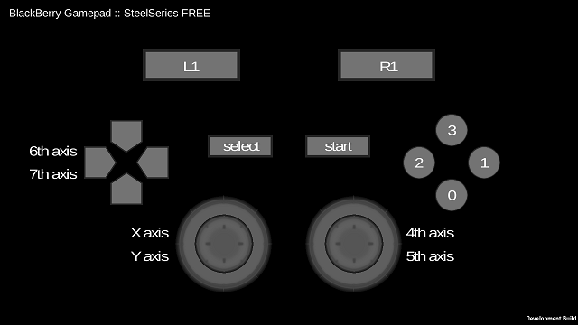
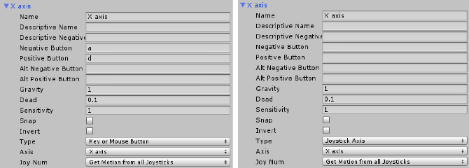
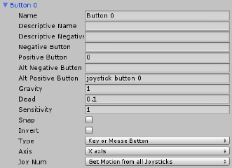
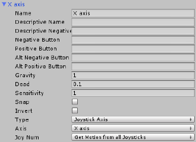
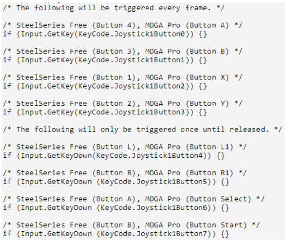

#Sample Project: Unity Gamepad#

This sample demonstrates the integration of gamepad functionality via the Input Manager within Unity. Many third-party extensions such as Daikon Forge GUI aim to simplify user-interface design within Unity and have built-in gamepad integration. This sample does not rely on third-party extensions, and instead tackles the problem directly via Input Manager configuration; though direct Input API calls are also a valid approach.
For the latest version of this code, please refer to the BlackBerry Github repository here: https://github.com/blackberry/Core-Native-Community-Samples

**Applies To**

* BlackBerry 10.2.1+
* Unity 4.3.3f1+

**Author(s)**

* [Erik Oros](mailto:eoros@blackberry.com), [Twitter](https://twitter.com/WaterlooErik)

**Contributing**

* To contribute code to this repository you must be [signed up as an official contributor](http://blackberry.github.com/howToContribute.html).

**Screenshots**


 
##How To Build##

1.	Clone/download this repository to your PC.
2.	Launch Unity and create a new project called Gamepad.
3.	Import the included **gamepad.unitypackage** asset into your new project by navigating:
	a.	**Assets > Import Package > Custom Package**; and selecting **gamepad.unitypackage** from the files you downloaded from this repository.
	b.	Note that the Asset files are also included, unpacked, for reference.
4.	Under the **_scenes** folder, double-click the **gamepad** scene to open the scene.

This sample can be run on the PC and accepts input via **WASD**, **arrow** keys, and numerical keys including **0-7**.

##Key Points##

*	All supported gamepads will identify themselves as **BlackBerry Gamepad :: SteelSeries Free**; including the MOGA Pro and other series of gamepads.
*	At the time of writing, **L2 and R2** are not currently mapped to any inputs.

All inputs (including axes and buttons) are defined within the **Input Manager**. With this approach, we were able to re-use the button axes to define both PC and Gamepad inputs, minimizing the number of axes we need to define.


    
For traditional axes (i.e. not buttons), we need to define separate inputs for keyboard and gamepad.



For buttons, we can specify two positive/negative inputs per axis.

##Detecting Gamepad Connectivity##

The best way to detect when a gamepad has been connected is through the Input.GetJoystickNames function. Inside the Start function, we poll to see whether any BlackBerry gamepads are connected and, if so, we accept input from that gamepad.

	```
    /* An array of connected gamepads. */
    private string[] connectedGamepads;
    /* The number of connected gamepads. */
    private int nConnectedGamepads;
    /* The most recent primary gamepad. */
    private string newConnectedGamepad;
    /* The current primary gamepad. */
    private string connectedGamepad;

    void Start () {

        /* Initialize our variables. */
        connectedGamepads = Input.GetJoystickNames();
        nConnectedGamepads = connectedGamepads.Length;
        newConnectedGamepad = "";
        connectedGamepad = "";

        /* Loop through the connected gamepads
           on startup to determine whether we have a valid match.
        */
        foreach (string gamepad in connectedGamepads) {
            if (gamepad.Contains("BlackBerry Gamepad") == true) {
               /* We have a connected gamepad! */
            }
        }
    }
	```

If there are no gamepads connected during startup, we can monitor for new connections inside of our Update function. This is also recommended in case active gamepads lose connections during gameplay and reconnect later.

	```
    void Update () {
        /**
         * Monitor for changes in connected gamepads.
         * In our case, we will default to the first
         * BlackBerry Gamepad that we find as the primary input device.
         */

        /* Check if the number of connected gamepads has
           changed (this will indicate a connect/disconnect.
        */
        connectedGamepads = Input.GetJoystickNames();
        if (connectedGamepads.Length != nConnectedGamepads) {

            /* Reset our variables as we will be
               looping through the list now.
            */
            nConnectedGamepads = connectedGamepads.Length;
            newConnectedGamepad = "";

            /* Cycle through each connected gamepad. */
            foreach(string gamepad in connectedGamepads) {

                /* We're only interested in BlackBerry supported gamepads. */
                if (gamepad.Contains("BlackBerry Gamepad") == true) {
                    /* We have a connected gamepad! */
                    break;
                }
            }

            /* If we could not find a connected gamepad. */
            connectedGamepad = newConnectedGamepad;
            if (connectedGamepad.Equals("") == true) {
                /* We could not find a gamepad! */
            }
        }
    }
	```

How we alert the user, if at all, depends on the specific use-case, but with the above, we are now able to monitor for gamepad connectivity.

##Receiving Gamepad Input##

Once your axes are configured within Unity’s Input Manager, obtaining data from them is quite straightforward and simply requires leveraging the **Input.GetAxisRaw** function. Unity’s internal axes are mapped to gamepads on BlackBerry as follows.


 
Therefore, if we configured our axis in the Input Manager as follows (note that the name can be anything, but I chose X axis for consistency):
 

 
Then we can use the following code to read data from that axis:

	```
	Input.GetAxisRaw("X axis");
	```

Which will yield a value between **-1.0 and 1.0**. Buttons that are mapped to axes will yield similar values depending on whether it is the negative button or positive button that is being interacted with. As noted before, for buttons you can omit the Input Manager axis definitions and read the data directly as follows.


 
The primary benefit here is that easy access to **Input.GetKey**, and more importantly **Input.GetKeyDown**, without the need to manage any reset flags manually.

#Additional Resources#

*	[BlackBerry Developer Blog – Unity and Gamepad](http://devblog.blackberry.com/2013/11/up-up-down-down-left-right-left-right-b-a-gamepad-offer-update/)
*	[Unity Documentation – Input Manager](http://docs.unity3d.com/Documentation/Components/class-InputManager.html)
*	[Unity Documentation – Input](https://docs.unity3d.com/Documentation/ScriptReference/Input.html)

